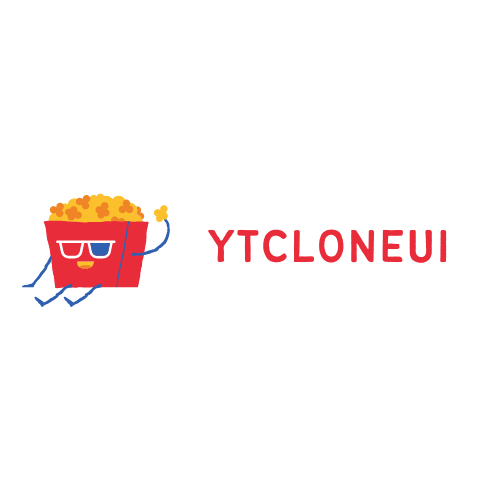

# YTCLONEUI ▶
***Entertainment in a flash***

## WHAT IS THIS ?
This is a non-functional front-end focused web app for mobile, Inspired by [YouTube](https://youtube.com)

## TO-DO / TASKS ✅
- [x] Icons
  -  [x] -Use Google Material Fonts-**REMOVED**
  -  [x] Favicon 5 Icons 
  

- [x] Home Tab 
  -  [x] Subscribe Popup
  -  [x] Icon Gradient Styling
  
- [x] Recommended Tab
- [x] Icon hover Flip Effect
- [x] Dark Mode
  -  [x] Icons Color Change on Tools Tab
  -  [x] Icons Color Change on the sticky Header
  -  [x] Vice Versa
- [ ] Tools Tab
  -  [ ] Aligning the texts of the options
  -  [ ] Change some Icons
- [x] Modal Boxes

###  TECHNOLOGIES USED🔨
* HTML
* Javascript
* CSS
* Firebase

#### FRAMEWORKS/LIBRARIES🧙‍♂️
* jQuery
* SweetAlert

### Resources/Tools Used
* [Canva](https://canva.com)
* [Previewed](https://previewed.io)
* [Trello](https://trello.com)

#### *A YouTube inspired web app 👩‍💻*
##### Wouldn't have reached this far without [CodeWithFriends](https://codewithfriends.io).

_**latest update - 2020/10/23 | 03:15 AM**_
